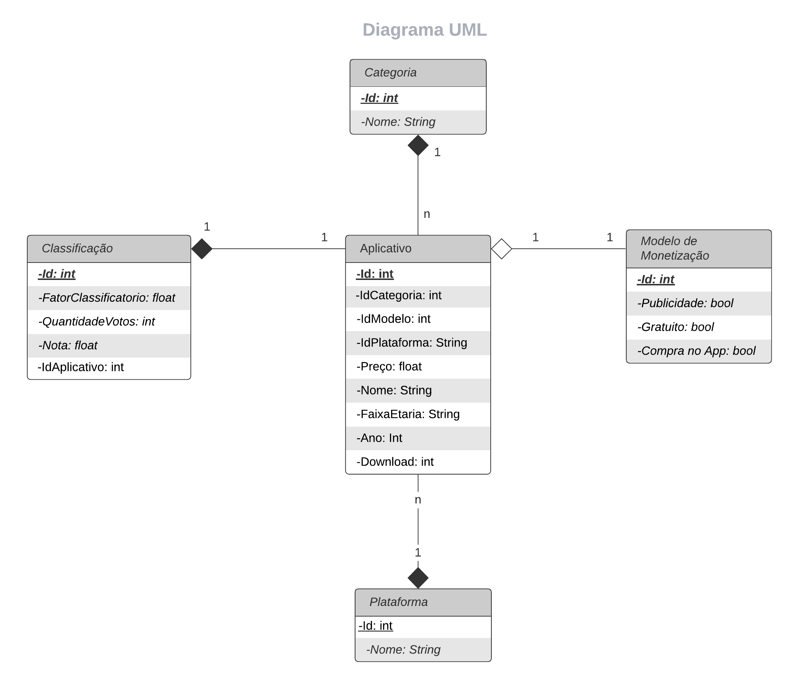
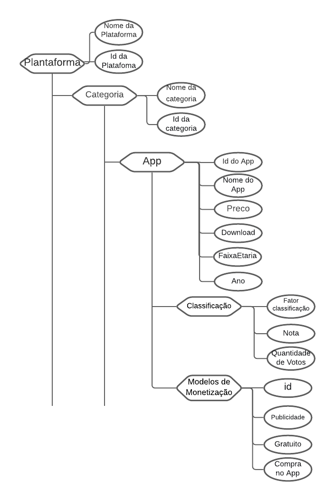
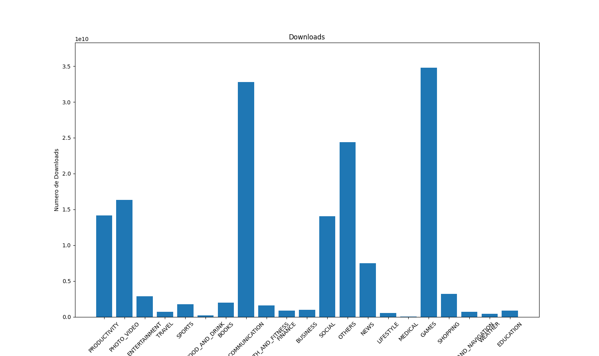
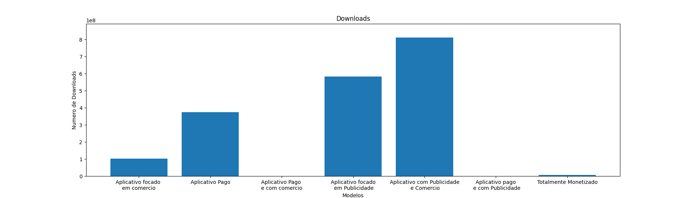
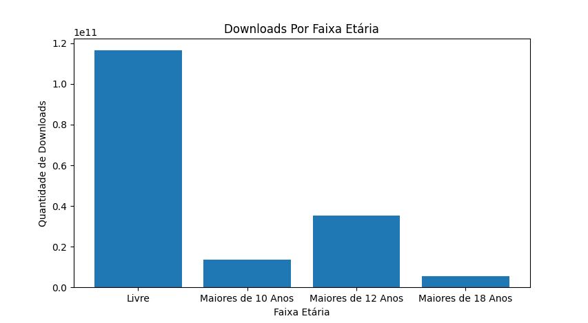

# Projeto `Mobile App Analysis`

# Equipe `Esquilos Berrantes` - `ESB`
* `Lucas Jacinto Gonçalves` - `240013`
* `Leonardo Novaes do Nascimento` - `220142`
* `Daniel Mendes dos Santos` - `214752`

## Resumo do Projeto
>  O projeto Mobile App Analysis visa analisar o comportamento das duas maiores plataformas mobile atualmente: Android e iOS através dos aplicativos que são disponibilizados nas respectivas lojas. Através do processamento de ambos os datasets é possível determinar, por exemplo, qual plataforma oferece para uma determinada empresa maior lucratividade na disponibilização dos seus anúncios.  
>  Além disso, é possível observar o comportamento de um aplicativo que possui uma versão paga e outra gratuita como, por exemplo, se a versão paga possui qualidade superior quando comparado com a versão gratuita.  
>  Na plataforma do Android no qual temos os datasets referentes a 2019 e 2021 será possível observar o comportamento dos aplicativos com relação a sua categoria que obtiveram crescimento durante o atual momento de pandemia.

## Slides da Apresentação
> [Slides](slides/esb.pdf)

## Modelo Conceitual
 
> 

## Modelos Lógicos

~~~
PLATAFORMA(_Id_, Nome)
CATEGORIA(_Id_, Nome)
APLICATIVO(_Id_, IdCategoria, IdModelo, IdPlataforma, Download, Preço, Nome, FaixaEtaria)
   IdCategoria chave estrangeira -> CATEGORIA(Id)
   IdModelo chave estrangeira -> MODELO_DE_MONETIZACAO(Id)
   IdPlataforma chave estrangeira -> PLATAFORMA(Id)
CLASSIFICACAO(_Id_, IdAplicativo, FatorClassificatorio, QuantidadeVotos, Nota)
   IdAplicativo chave estrangeira -> APLICATIVO(Id)
MODELO_DE_MONETIZACAO(_Id_, Publicidade, Gratuito, CompraNoApp)
~~~

> 

## Dataset Publicado
> Elencar os arquivos/bases preliminares dos datasets serão publicados.

título do arquivo/base | link | breve descrição
----- | ----- | -----
`<título do arquivo/base>` | `<link para arquivo/base>` | `<breve descrição do arquivo/base>`

> Os arquivos finais do dataset publicado devem ser colocados na pasta `data`, em subpasta `processed`. Outros arquivos serão colocados em subpastas conforme seu papel (externo, interim, raw). A diferença entre externo e raw é que o raw é em formato não adaptado para uso. A pasta `raw` é opcional, pois pode ser substituída pelo link para a base original da seção anterior.
> Coloque arquivos que não estejam disponíveis online e sejam acessados pelo notebook. Relacionais (usualmente CSV), XML, JSON e CSV ou triplas para grafos.
> Este é o conjunto mínimo de informações que deve constar na disponibilização do Dataset, mas a equipe pode enriquecer esta seção.

## Bases de Dados

título da base | link | breve descrição
----- | ----- | -----
`Google Play Store Apps` | `https://www.kaggle.com/lava18/google-play-store-apps` | `Dataset com 10 mil dados de Aplicativos no Play Store para a análise.`
`Google Play Store Apps` | `https://www.kaggle.com/gauthamp10/google-playstore-apps` | `Dataset com 2.3 milhões de Aplicativos na Play Store para a análise.`
`Mobile App Store ( 7200 apps)` | `https://www.kaggle.com/ramamet4/app-store-apple-data-set-10k-apps` | `Dataset com 7200 dados de Aplicativos no IOs para a análise.`

## Detalhamento do Projeto
> O projeto em questão é estruturado em com o auxílio de 6 códigos em python (disponível em: https://github.com/Orolios/TrabalhoBD_MC536/tree/main/final/src/banco) através de um servidor local MySql. Sendo esses códigos dividos em códigos de "Estruturação e Conexão" e em códigos de "Tratamento e Inserção".
### "Estruturação e Conexão"
#### connetion.py
> Nesse códico em questão apenas se faz a conexão do python ao MySql e ao banco de dados criado localmente pelo terminal do MySql da seguinte forma:
~~~python
import mysql.connector
from mysql.connector import Error
def create_connection(host_name, user_name, user_password,db_name):
    connection = None
    try:
        connection = mysql.connector.connect(
            host=host_name,
            user=user_name,
            passwd=user_password,
            database=db_name,
        )
        print("Connection to MySQL DB successful")
    except Error as e:
        print(f"The error '{e}' occurred")
    return connection

connection = create_connection("127.***.***.**", "root", "password","database")
~~~
> Diante disso, qualquer código que faça alguma operação no banco, deverá importar o objeto connetion em seu código.
#### util.py
> Aqui faz-se o estruturarmento e pré-tratamento dos dados das tabelas mães e a criação de funções úteis que definem dicionários utilizados no tratamento dos dados dos csv's((disponível em: https://github.com/Orolios/TrabalhoBD_MC536/tree/main/final/data)) dos códigos de "Tratamento e inserção.
#### body.py
> Aqui se cria o Banco em si, ou seja, ao executar esse código, uma sequência de queries é executada de forma a criar as tabelas do banco e seus respectivos relacionamentos. A partir disso, insere-se os dados antes trabalhados em Util.py, os quais definirão importantes relacinamentos e chaves para a análise das tabelas, bem como a própria tabela de Modelo de monetização (ModMon) que é a síntese de uma simplificação de quais são os possíveis jeitos de monetizar um aplicativo.
> Exemplo:
~~~python
def insert_categorias_database(connection, array):
    cursor = connection.cursor()
    print(array)
    try:
        for x in array:
            query = ("INSERT INTO Categoria (Nome) values('{}');".format(x))
            cursor.execute(query)
        query = ("INSERT INTO Plataforma (Nome) values('{}');".format("Android"))
        cursor.execute(query)
        query = ("INSERT INTO Plataforma (Nome) values('{}');".format("Ios"))
        cursor.execute(query)

        connection.commit()
        print("Queries executada!")

    except Exception as e:
        print(f"The error '{e}' occurred")
~~~
### "Tratamento e Inserção"
> Em todos os arquivos dessa secção trabalham-se a leitura do csv e adaptação dos dados de forma a deixá-los no molde do banco. Diante disso, para cada código/csv os dados são lidados de maneira diferente. Por exemplo:
> Em apple.py teremos:
~~~python
def publico(case):
    if case == "4+":
        return "Livre"
    elif case == "9+":
        return "Maiores de 10 anos"
    elif case == "12+":
        return "Maiores de 12 anos"
    elif case == "17+":
        return "Maiores de 18 anos"
    else:
        return "Livre"
~~~
>Já em google.py teremos:
~~~python
def publico(case):
    if case == "Everyone":
        return "Livre"
    elif case == "Everyone 10+":
        return "Maiores de 10 anos"
    elif case == "Teen":
        return "Maiores de 12 anos"
    elif case == "Mature 17+":
        return "Maiores de 18 anos"
    else:
        return "Livre"
~~~
> Dessa forma  a inforação converge para o mesmo modelo e se apta para os moldes definidos pelo dataset a ser criado.

## Evolução do Projeto
> O Projeto Mobile App Analysis foi escolhido com o objetivo de analisar os aplicativos Android e iOS com relação a vários fatores como: aplicativos mais bem avaliados com relação a sua categoria, relação de aplicativos pagos e gratuitos, quantidade de downloads por plataformas referentes aos apps. Primeiramente pensamos em utilizar o modelo lógico de grafos, porém devido a debates com os membros do grupo sobre a estrutura do arquivo CSV, determinamos que o modelo de documentos seria o candidato ideal, ao contrário do modelo de grafos. Utilizamos também o Modelo Tabular no qual importamos os arquivos brutos do site Kaggle, onde utilizamos operações de construção do nosso dataset sobre esses arquivos em CSV como: tratamento de dados através da exclusão dos aplicativos que não possuem avaliação e quantidade de downloads informados, integração dos dados através da construção de tabelas utilizando SQL e transformação de dados para facilitar a análise e pesquisa. 
> Durante o desenvolvimento do nosso projeto, aprendemos a utilizar bibliotecas para a geração de gráficos que sustentariam nossa análise, bem como aprendemos a utilizar Python com SQL e integrar com o banco de dados que estávamos construindo. 
> Um dos desafios enfrentados pelo nosso grupo durante o processo de modelagem do banco, foi que precisaríamos construir um modelo que permitisse trabalhar com os aplicativos Android e iOS que são de plataformas diferentes e, portanto, precisam ser tratados de forma diferentes. Por exemplo,  criamos uma tabela denominada Plataforma com um ID referente ao Android e outro ao iOS. Essa tabela é utilizada pela tabela Aplicativos e dessa forma, nos possibilitou análises elaboradas envolvendo as duas plataformas para um mesmo aplicativo.
> Para a construção do banco de dados da loja da Google referente ao ano de 2021 limitamos o número de aplicativos para próximo de 10.000, pois devido a gigante quantidade de aplicativos nesta plataforma neste ano, duraria dias para o processamento completo, inviabilizando a entrega do projeto dentro do prazo determinado,  portanto, a limitação sobre a quantidade dos aplicativos construída para esse banco em específico precisou ser imposta.

## Perguntas de Pesquisa/Análise Combinadas e Respectivas Análises

>Para a análise e resposta das perguntas, fez-se as seguintes queries:
~~~sql
SELECT Categoria.nome AS Categorias, SUM(Apps_2019.download) AS Donwloads
FROM (SELECT Aplicativo.id, Aplicativo.nome, Aplicativo.Idcategoria, Aplicativo.download, Class.nota, Class.quantidadeVotos, Class.fator
FROM Aplicativo, Class
WHERE Aplicativo.ano = 2019 AND Aplicativo.id = Class.idAplicativo AND Aplicativo.idPlataforma = 1
)Apps_2019, Categoria
WHERE Apps_2019.IdCategoria = Categoria.id
GROUP BY Apps_2019.IdCategoria;

SELECT DISTINCT top10.nome from (
SELECT Aplicativo.nome, Class.fator, Categoria.Nome as categoria, Aplicativo.faixa_etaria, Aplicativo.download, Class.quantidadeVotos
FROM app_mc536.Aplicativo, app_mc536.Class, app_mc536.Categoria
WHERE Aplicativo.id = Class.idAplicativo AND Aplicativo.idCategoria = Categoria.id
ORDER BY  Class.fator DESC, Class.quantidadeVotos DESC, Class.nota DESC
LIMIT 1, 100
)top10
LIMIT 1, 10;

SELECT Aplicativo.faixa_etaria, SUM(Aplicativo.download)
FROM Aplicativo
WHERE Aplicativo.preco <> 0
GROUP BY Aplicativo.faixa_etaria;

SELECT Categoria.nome, SUM(Class.quantidadeVotos)
FROM Aplicativo, Categoria, Class
WHERE Aplicativo.idCategoria = Categoria.id AND Class.idAplicativo = Aplicativo.id
GROUP BY Categoria.nome;

SELECT ModMon.Tipo AS Modelo, SUM(Ap.download) AS Downloads
FROM Aplicativo Ap, ModMon
Where Ap.idModelo = ModMon.id
GROUP BY ModMon.Tipo;
~~~
### Perguntas/Análise com Resposta Implementada

#### Pergunta/Análise 1
> * Pergunta 1
>   
>   * Os conteúdos mais bem avaliados e a relação com as categorias as quais eles pertencem
>   
>   
>   Os aplicativos mais bem avaliados da loja Google Play em ordem decrescente de importância são:  
>   WhatsApp Messenger, Instagram, Messenger Text and Video Chat for Free, Clash of Clans, Clean Master - Space Cleaner & Antivirus, Subway Surfers, Youtube, Security Master - Antivirus, VPN, AppLock, Booster, Clash Royale e Candy Crush Saga.
>   Neste banco de dados, podemos encontrar os aplicativos mais bem rentáveis através do fator  classificação. Esse fator é calculado a partir da nota e das quantidade de avaliações.
Além disso podemos relacionar números de downloads, número de avaliações e  fator  classificação. Além disso podemos encontrar os aplicativos mais bem avaliados para cada tipo de categoria 
(Aqui podemos usar o modelo de documentos já que nem todos os aplicativos possui todas informações conhecidas porém compartilham uma mesma estrutura)

#### Pergunta/Análise 2
> * Pergunta 2
>   
>   * Qual a proporção dos aplicativos com relação a seu modelo de monetização?
>   
>  Anteriormente existia a categoria “Sem monetização”, porém ela foi excluída por ser muito grande!
> De acordo com o gráfico de Downloads por Modelos, os modelos de monetização como:  aplicativo com suporte a publicidade e compras no app (comércio), aplicativo focado em publicidade  e aplicativos pagos são os modelos de negócios mais rentáveis atualmente.
> Aplicativos focados em comércio (compras no app) são em torno de 6x menos lucrativos quando em comparação com os aplicativos focados em publicidade e cerca de 8x menos lucrativos quando comparados a aplicativos que possibilitam o suporte a publicidade e comércio (compras no app). 

#### Pergunta/Análise 3
> * Pergunta 3
> 
>   * Levando em consideração a faixa etária e a plataforma no qual o aplicativo pertence, qual a categoria de aplicativo mais baixado por cada público-alvo ?  
> 
>   A Faixa Etária Livre possui a maior quantidade de downloads juntamente com a Faixa Etária para indivíduos maiores de 12 anos.   

