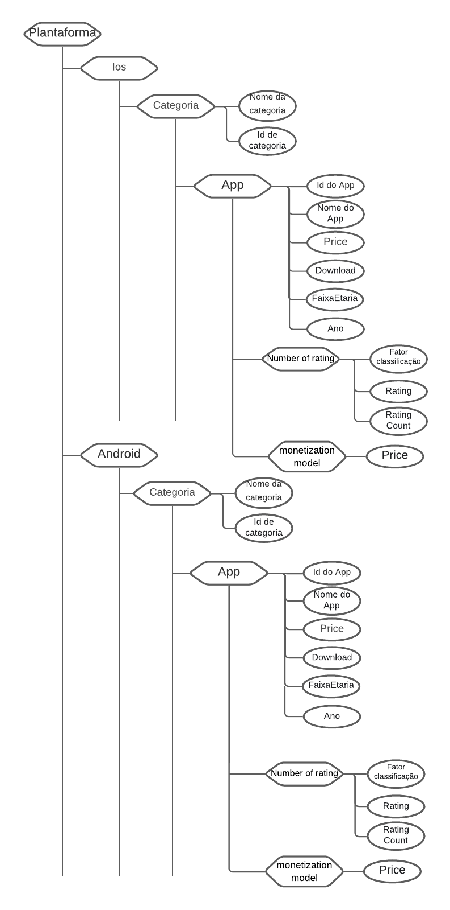

# Projeto `<Mobile App Analysis>`

# Equipe `<Esquilos Berrantes>` - `<ESB>`
* `<Lucas Jacinto Gonçalves>` - `<240013>`
* `<Leonardo Novaes do Nascimento>` - `<220142>`
* `<Daniel Mendes dos Santos>` - `<214752>`

## Resumo do Projeto
>  O projeto Mobile App Analysis visa analisar o comportamento das duas maiores plataformas mobile atualmente: Android e iOS através dos aplicativos que são disponibilizados nas respectivas lojas. Através do processamento de ambos os datasets é possível determinar, por exemplo, qual plataforma oferece para uma determinada empresa maior lucratividade na disponibilização dos seus anúncios.  
>  Além disso, é possível observar o comportamento de um aplicativo que possui uma versão paga e outra gratuita como, por exemplo, se a versão paga possui qualidade superior quando comparado com a versão gratuita.  
>  Na plataforma do Android no qual temos os datasets referentes a 2019 e 2021 será possível observar o comportamento dos aplicativos com relação a sua categoria que obtiveram crescimento durante o atual momento de pandemia.

## Slides da Apresentação
> [Slides](slides/esb.pdf)

## Modelo Conceitual

> Coloque aqui a imagem do modelo conceitual final em ER ou UML, como o exemplo a seguir:  
> 

## Modelos Lógicos

> Coloque aqui os modelos lógicos dos bancos de dados relacionados aos modelos conceituais. Para o modelo relacional, sugere-se o formato a seguir. Para outros modelos lógicos, sugere-se aqueles apresentados em sala.

> Exemplo de modelo lógico relacional
~~~
PLATAFORMA(_Id_, Nome)
CATEGORIA(_Id_, Nome)
APLICATIVO(_Id_, IdCategoria, IdModelo, IdPlataforma, Download, Preço, Nome, FaixaEtaria)
   IdCategoria chave estrangeira -> CATEGORIA(Id)
   IdModelo chave estrangeira -> MODELO_DE_MONETIZACAO(Id)
   IdPlataforma chave estrangeira -> PLATAFORMA(Id)
CLASSIFICACAO(_Id_, IdAplicativo, FatorClassificatorio, QuantidadeVotos, Nota)
   IdAplicativo chave estrangeira -> APLICATIVO(Id)
MODELO_DE_MONETIZACAO(_Id_, Publicidade, Gratuito, CompraNoApp)
~~~

> Para modelos hierárquicos (XML e JSON), utilize um formato
> conforme o abaixo:

> 

## Dataset Publicado
> Elencar os arquivos/bases preliminares dos datasets serão publicados.

título do arquivo/base | link | breve descrição
----- | ----- | -----
`<título do arquivo/base>` | `<link para arquivo/base>` | `<breve descrição do arquivo/base>`

> Os arquivos finais do dataset publicado devem ser colocados na pasta `data`, em subpasta `processed`. Outros arquivos serão colocados em subpastas conforme seu papel (externo, interim, raw). A diferença entre externo e raw é que o raw é em formato não adaptado para uso. A pasta `raw` é opcional, pois pode ser substituída pelo link para a base original da seção anterior.
> Coloque arquivos que não estejam disponíveis online e sejam acessados pelo notebook. Relacionais (usualmente CSV), XML, JSON e CSV ou triplas para grafos.
> Este é o conjunto mínimo de informações que deve constar na disponibilização do Dataset, mas a equipe pode enriquecer esta seção.

## Bases de Dados
> Elencar as bases de dados fonte utilizadas no projeto.

título da base | link | breve descrição
----- | ----- | -----
`<título da base>` | `<link para a página da base>` | `<breve descrição da base>`

## Detalhamento do Projeto
> Apresente aqui detalhes do processo de construção do dataset e análise. Nesta seção ou na seção de Perguntas podem aparecer destaques de código como indicado a seguir. Note que foi usada uma técnica de highlight de código, que envolve colocar o nome da linguagem na abertura de um trecho com `~~~`, tal como `~~~python`.
> Os destaques de código devem ser trechos pequenos de poucas linhas, que estejam diretamente ligados a alguma explicação. Não utilize trechos extensos de código. Se algum código funcionar online (tal como um Jupyter Notebook), aqui pode haver links. No caso do Jupyter, preferencialmente para o Binder abrindo diretamente o notebook em questão.

~~~python
df = pd.read_excel("/content/drive/My Drive/Colab Notebooks/dataset.xlsx");
sns.set(color_codes=True);
sns.distplot(df.Hemoglobin);
plt.show();
~~~

> Se usar Orange para alguma análise, você pode apresentar uma captura do workflow, como o exemplo a seguir e descrevê-lo:

> Coloque um link para o arquivo do notebook, programas ou workflows que executam as operações que você apresentar.

> Aqui devem ser apresentadas as operações de construção do dataset:
* extração de dados de fontes não estruturadas como, por exemplo, páginas Web
* agregação de dados fragmentados obtidos a partir de API
* integração de dados de múltiplas fontes
* tratamento de dados
* transformação de dados para facilitar análise e pesquisa

> Se for notebook, ele estará dentro da pasta `notebook`. Se por alguma razão o código não for executável no Jupyter, coloque na pasta `src` (por exemplo, arquivos do Orange ou Cytoscape). Se as operações envolverem queries executadas atraves de uma interface de um SGBD não executável no Jupyter, como o Cypher, apresente na forma de markdown.

## Evolução do Projeto
> Relatório de evolução, descrevendo as evoluções na modelagem do projeto, dificuldades enfrentadas, mudanças de rumo, melhorias e lições aprendidas. Referências aos diagramas, modelos e recortes de mudanças são bem-vindos.
> Podem ser apresentados destaques na evolução dos modelos conceitual e lógico. O modelo inicial e intermediários (quando relevantes) e explicação de refinamentos, mudanças ou evolução do projeto que fundamentaram as decisões.
> Relatar o processo para se alcançar os resultados é tão importante quanto os resultados.

## Perguntas de Pesquisa/Análise Combinadas e Respectivas Análises

> Apresente os resultados da forma mais rica possível, com gráficos e tabelas. Mesmo que o seu código rode online em um notebook, copie para esta parte a figura estática. A referência a código e links para execução online pode ser feita aqui ou na seção de detalhamento do projeto (o que for mais pertinente).

> Liste aqui as perguntas de pesquisa/análise e respectivas análises. Nem todas as perguntas precisam de queries que as implementam. É possível haver perguntas em que a solução é apenas descrita para demonstrar o potencial da base. Abaixo são ilustradas três perguntas, mas pode ser um número maior a critério da equipe.
>

## Perguntas de Pesquisa/Análise Combinadas e Respectivas Análises

> Liste aqui as perguntas de pesquisa/análise e respectivas análises.
> Nem todas as perguntas precisam de queries que as implementam.
> É possível haver perguntas em que a solução é apenas descrita para
> demonstrar o potencial da base.
>
### Pergunta/Análise 1
> * Quais são os Top 3 aplicativos mais bem avaliados com suporte para propaganda com relação às categorias às quais eles pertencem ?
>   
>   

### Pergunta/Análise 2
> * Relacionando aplicativos pagos com os aplicativos gratuitos.
>   

### Pergunta/Análise 3

> * Levando em consideração a faixa etária e a plataforma no qual o aplicativo pertence, qual a categoria de aplicativo mais baixado por cada público-alvo ?
> 
